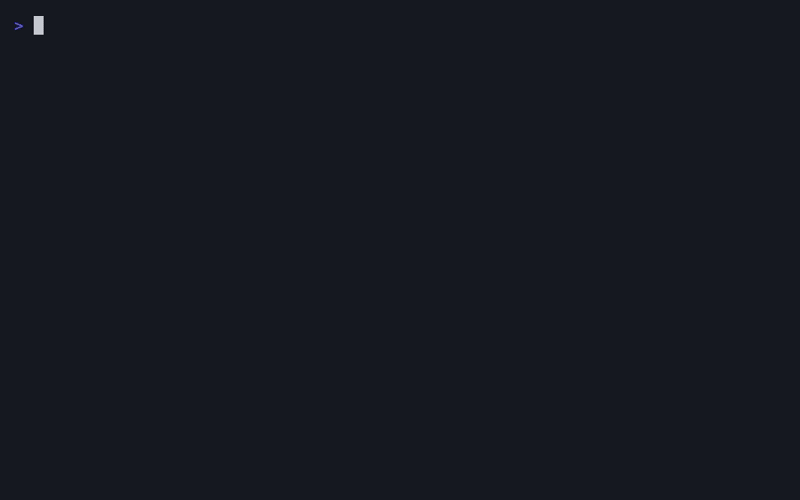

# gotip

Go Test Interactive Picker



## About

gotip is a TUI application for interactively selecting and running Go tests.

Key features:

- Fuzzy filtering of test cases
- Detection of subtest names defined via table-driven tests (partial support)
- Run individual subtests or grouped subtests
- View and re-run tests from execution history

## Installation

```
go install github.com/lusingander/gotip/cmd/gotip@latest
```

## Usage

### Basic usage

In a directory containing a `go.mod` file, run:

```
gotip
```

While a test is selected, press <kbd>Enter</kbd> to run it using `go test`.

### Passing additional arguments

You can pass extra flags directly to `go test` by appending them after `--`:

```
gotip -- -v -count=1
```

### Running a parent test group

While a test is selected, press <kbd>Backspace</kbd> to move up to its parent test group.

This allows you to execute all subtests under that group.  
For example, if you have `TestFoo/Bar/Baz` selected, pressing <kbd>Backspace</kbd> will select `TestFoo/Bar`, and running it will execute all tests under that prefix.

If subtest names could not be automatically discovered, gotip defaults to selecting the nearest available parent test.


### Using test history

Press <kbd>Tab</kbd> to switch to History view.

In this view, you can select and run tests from your previous execution history, just like in the regular view.

The history data is stored under `.local/state/gotip/history/`.


### Config

You can configure gotip by placing a `gotip.toml` file in the current directory.

The format is as follows:

```toml
# Specifies the command used to run tests.
# If omitted, the default command is used.
# type: list of strings
command = []

[history]
# Limits the number of test executions to keep in history.
# type: integer
limit = 100
# Format used to display timestamps in the history view.
# Uses Go's time format syntax.
# type: string
date_format = "2006-01-02 15:04:05"
```

#### `command`

The `command` field allows you to customize how tests are executed.

You can use this to always pass specific flags or use an external test runner instead of the default.

For example, to use [gotestsum](https://github.com/gotestyourself/gotestsum), you can configure it like this:

```toml
command = ["gotestsum", "--format", "testname", "--", "-run", "${name}", "${package}"]
```

`${name}` and `${package}` are placeholders that will be replaced at runtime with the selected test name pattern and package name, respectively.

If not specified, the following default command is used:

```toml
command = ["go", "test", "-run", "${name}", "${package}"]
```

### Keybindings

| Key                         | Description                                |
| --------------------------- | ------------------------------------------ |
| <kbd>Ctrl-c</kbd>           | Quit                                       |
| <kbd>j</kbd> <kbd>↓</kbd>  | Select next item                           |
| <kbd>k</kbd> <kbd>↑</kbd>  | Select previous item                       |
| <kbd>l</kbd> <kbd>→</kbd>  | Select next page                           |
| <kbd>h</kbd> <kbd>←</kbd>  | Select previous page                       |
| <kbd>Enter</kbd>            | Run the selected test                      |
| <kbd>Backspace</kbd>        | Select parent test group                   |
| <kbd>/</kbd>                | Enter filtering mode                       |
| <kbd>Enter</kbd>            | Confirm filter (in filtering mode)         |
| <kbd>Esc</kbd>              | Clear filtering mode                       |
| <kbd>Ctrl-x</kbd>           | Toggle filtering type                      |
| <kbd>Tab</kbd>.             | Switch view                                |

## Planned features

- Launch with initial filter based on package or test name
- Custom keybindings

## License

MIT
